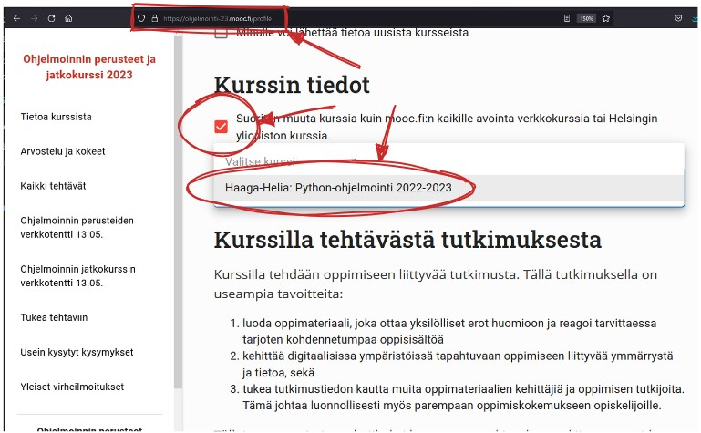

<h1 class="js-toc-ignore">Python-ohjelmointi, kesä 2023</h1>

Tämän kurssin opettajina toimivat Teemu Havulinna ja Kasper Valtakari (etunimi.sukunimi@haaga-helia.fi). Kurssin kehittämisessä on mukana myös Heikki Raatikainen.

Kurssi toteutetaan täysin virtuaalisesti, eli se ei sisällä oppitunteja kampuksella eikä videoyhteydellä. Oppituntien sijaan saatavillasi on videoita ja tekstimuotoista oppimateriaalia niin kurssin puolesta kuin netin avoimista oppimateriaaleista. Kurssin tehtäviin on saatavissa apua kurssin Teams-kanavalla.

> *"VIRTUAL on itsenäistä opiskelua toteutuksen aukioloaikana. Virtuaalitoteutuksissa ei ole lukujärjestykseen merkittyä pakollista opetusta tai muuta tapaamista verkossa, vaan opiskelijat suorittavat tehtäviä toteutussuunnitelman aikataulun ja määräaikojen mukaan. Samaan aikaan opiskelevat voivat olla yhteydessä toisiinsa ja virtuaaliopiskelun ohjaajaan keskustelualueen kautta."*
>
> [https://mynet.haaga-helia.fi/group/pakki/lukkarikone](https://mynet.haaga-helia.fi/group/pakki/lukkarikone)

**Tällä sivulla:**

## 💬 Tiedotus- ja tukikanavat

Kurssin tiedotus- ja tukikanavina käytämme omaa MS Teams -ryhmäämme ja [Helsingin yliopiston Discord-kanavia](https://ohjelmointi-23.mooc.fi/#tukivaylat). Discordissa on saatavissa reaaliaikaista apua ja sieltä löytyy myös tekstihaku, jonka avulla löydät aikaisemmin esitettyjä kysymyksiä samoista tehtävistä.

Kurssin suuresta osallistuja- ja tehtävämäärästä johtuen emme tarjoa ohjausta yksittäisiin tehtäviin sähköpostitse. Et kuitenkaan jää tehtävien kanssa yksin, kun käytät edellä mainittuja Teams- ja Discord-kanavia.

## 📣 MS Teams -ryhmä

Kirjaudu ennen kurssin ensimmäistä oppituntia Teamsiin Haaga-Helian käyttäjätunnuksellasi sekä koodilla, jonka löydät kurssin [Moodle-sivulta](https://hhmoodle.haaga-helia.fi/).

## ✔️ Kurssin osallistumisen vahvistaminen

Kurssin osallistumisen vahvistaminen edellyttää kurssin järjestelmiin\* liittymistä ja ohjelmointitehtävien suorittamista aktiivisesti\*\* ensimmäisten kahden viikon aikana. Tehtäviin on saatavissa vinkkejä ja tukea kurssin Teams-kanavalla sekä oppitunneilla.

Menettelyn ei ole tarkoitus karsia ketään pois kurssilta, vaan varmistaa, että työskentely kurssin parissa lähtee kaikilla hyvin käyntiin.

<small>* Teams ja [ohjelmointi-23.mooc.fi](https://ohjelmointi-23.mooc.fi/)</small>

<small>** mooc.fi:n osa 1:n ensimmäisen sivun tehtävien (5 kpl) tekeminen tulkitaan aktiiviseksi suorittamiseksi</small>

### Kurssin keskeyttäminen

Kurssin keskeyttäminen ei ole Haaga-Helian linjauksia noudattaen mahdollista enää osallistumisen vahvistamisen jälkeen:

> *"Opettaja poistaa opetuksen alussa toteutukselta opiskelijat, jotka eivät osallistu ensimmäiseen opetuskertaan tai ilmoita poissaolostaan. Opiskelijoita ei enää myöhemmin poisteta toteutukselta, vaan kaikille annetaan arvosana hylätty-kiitettävä."*
>
> *[https://mynet.haaga-helia.fi/group/pakki/toteutukselle-ilmoittautuminen](https://mynet.haaga-helia.fi/group/pakki/toteutukselle-ilmoittautuminen)*

## 👨‍🏫 Helsingin yliopiston mooc ja kurssin tehtävät

Kurssin harjoitusympäristönä ja pääasiallisena materiaalina hyödynnetään Helsingin yliopiston ohjelmoinnin perusteet -mooc-kurssia [https://ohjelmointi-23.mooc.fi/](https://ohjelmointi-23.mooc.fi/). Suoritamme mooc.fi:ssä **ohjelmoinnin perusteet** -osiota (osat 1-7), emmekä etene ohjelmoinnin jatkokurssille.

Haaga-Helian kurssin suorittamiseksi sinun tulee vaihtaa kurssitoteutukseksi [mooc.fi:n profiilisivulla](https://ohjelmointi-23.mooc.fi/profile) juuri Haaga-Helian toteutus seuraavan ohjeen mukaisesti:

[Mooc.fi-rekisteröityminen ja Haaga-Helian toteutukselle liittyminen.](kurssille-liittyminen) Muista myös tallentaa profiilisi muutokset profiilisivun alaosan "Tallenna" painikkeella.

**Haaga-Helian kurssin valitseminen profiiliisi on erittäin tärkeää, koska vain silloin näemme suorituksesi tällä kurssilla.**

### 🚫 Kyselyt ja kertauskyselyt

Tämän kurssin tehtävät koostuvat ainoastaan mooc.fi:n **ohjelmointitehtävistä**. Kyselyihin ja kertauskyselyihin antamanne vastaukset ja niistä saamanne pisteet eivät tallennu samaan järjestelmään ohjelmointitehtävien kanssa, eikä niitä huomioida kurssin arvioinnissa. Suosittelemme silti niihin vastaamista oman osaamisen vahvistamiseksi.

### 🧙‍♂️ Ohjelmoinnin jatkokurssi

Haaga-Helian omassa tarjonnassa ei ole tällä hetkellä Python-ohjelmoinnin jatkokurssia, mutta sellainen on mahdollista suorittaa itsenäisesti Helsingin yliopiston mooc.fi-palvelussa.

Saatuasi jatkokurssin suoritettua HY:n puolella voit hakea opintojakson sisällyttämistä tutkintoosi. Lisätietoja löydät sivulta [https://www.haaga-helia.fi/fi/osaamisen-tunnistaminen-ja-work-study](https://www.haaga-helia.fi/fi/osaamisen-tunnistaminen-ja-work-study) kohdasta "hyväksiluku".

## 🔗 Tärkeät linkit

**Tämä kurssi**

* [Oppituntien videot (OneDrive)](https://haagahelia.sharepoint.com/:f:/r/teams/Python-ohjelmointi711/Jaetut%20asiakirjat/General?csf=1&web=1&e=TE7Tas)
* [Opintojaksokuvaus](https://opinto-opas.haaga-helia.fi/course_unit/SOF004AS2A)
* [Oma pistetilanne (TMC-palvelussa)](https://tmc.mooc.fi/org/haaga-helia/)
* [Sekalaisia vinkkejä työkaluihin liittyen](/vinkit)
* [Oppituntien esimerkkikoodit (kevät 2023)](https://github.com/python-ohjelmointi/esimerkit-k23/)
* [Oppituntien esimerkkikoodit (arkisto, syksy 2022)](https://github.com/python-ohjelmointi/esimerkit-s22/)
* [Oppituntien esimerkkikoodit (arkisto, kevät 2022)](https://github.com/python-ohjelmointi/esimerkit/)

**Mooc.fi**

* [Materiaalit ja tehtävät (https://ohjelmointi-23.mooc.fi/)](https://ohjelmointi-23.mooc.fi/)
* [HY:n Discordiin liittyminen](https://study.cs.helsinki.fi/discord/join/ohjelmoinnin_mooc)
* [TestMyCode -laajennuksen asentaminen VS Codeen](https://www.mooc.fi/fi/installation/vscode/#TestMyCode-asentaminen)
* [TMC-laajennuksen käyttäminen](https://www.mooc.fi/fi/installation/vscode/#ohjelmoinnin-aloittaminen)

**Python ja VS Code**

* [Ohjelmoinnin perusteet Pythonilla. PDF-kalvosetti. Teemu Sirkiä / Aalto-yliopisto](http://www.cs.hut.fi/~ttsirkia/Python.pdf)
* [Python 3 - ohjelmointiopas (v. 1.2.1). Erno Vanhala ja Uolevi Nikula / Lappeenrannan Yliopisto](https://lutpub.lut.fi/bitstream/handle/10024/162088/Vanhala2020-Python3Ohjelmointiopas.pdf?sequence=1&isAllowed=y)
* [The Python Tutorial](https://docs.python.org/3.10/tutorial/)
* [CS50's Introduction to Programming with Python](https://cs50.harvard.edu/python/2022/)
* [Visual Studio Code Tips and Tricks](https://code.visualstudio.com/docs/getstarted/tips-and-tricks)

## 🎬 Videotallenteet ja koodiesimerkit

Helsingin yliopiston videotallenteet löytyvät [mooc.fi:stä](https://ohjelmointi-23.mooc.fi/#luentotallenteet). Lisäksi löydät erinomaisia Python-videoita YouTubesta, esim. [Harvardin CS50-kurssin soittolistalta](https://www.youtube.com/playlist?list=PLhQjrBD2T3817j24-GogXmWqO5Q5vYy0V).

## 📅 Suositeltu aikataulu

Kurssin tehtävillä ei ole yksittäisiä määräaikoja. Kurssin arvioinnissa huomioidaan ne pisteet, jotka on kertynyt tehtävistä kurssin loppuun mennessä. Tämänkin jälkeen tehtäviä voi edelleen ratkoa, mutta ne eivät enää vaikuta arviointiin.

Alla on kurssin suositeltu suoritusaikataulu, jossa suorittamiseen on varattu 13 viikkoa. Helsingin yliopiston opintojakson etenemisvauhti on huomattavasti meidän vauhtiamme nopeampi ja voit myös edetä heidän tahdissaan.

### Viiko 1: Ohjelmoinnin aloitus (mooc.fi osa 1)

* Ohjelmistojen asennus
* Ohjelmoinnin aloittaminen
* Tietoa käyttäjältä
* [Materiaalit (mooc.fi)](https://ohjelmointi-23.mooc.fi/osa-1)
* [📁 Oppitunnin esimerkkikoodit](https://github.com/python-ohjelmointi/esimerkit-k23/tree/master/osa01)
* 📁 Esimerkkiarkisto: [syksy 2022](https://github.com/python-ohjelmointi/esimerkit-s22/blob/main/osa01), [kevät 2022](https://github.com/python-ohjelmointi/esimerkit/blob/main/osa01)

### Viiko 2: Muuttujat ja ehdot (mooc.fi osa 1)

* Lisää muuttujista
* Laskentaa luvuilla
* Ehtorakenne
* [Materiaalit (mooc.fi)](https://ohjelmointi-23.mooc.fi/osa-1)
* [📁 Oppitunnin esimerkkikoodit](https://github.com/python-ohjelmointi/esimerkit-k23/tree/master/osa01)
* 📁 Esimerkkiarkisto: [syksy 2022](https://github.com/python-ohjelmointi/esimerkit-s22/blob/main/osa01), [kevät 2022](https://github.com/python-ohjelmointi/esimerkit/blob/main/osa01)

### Viiko 3: Terminologia, ehtolauseet (mooc.fi osa 2)

* Ohjelmoinnin termejä
* Lisää ehtolauseita
* [Materiaalit (mooc.fi)](https://ohjelmointi-23.mooc.fi/osa-2)
* [📁 Oppitunnin esimerkkikoodit](https://github.com/python-ohjelmointi/esimerkit-k23/tree/master/osa02)
* 📁 Esimerkkiarkisto: [syksy 2022](https://github.com/python-ohjelmointi/esimerkit-s22/blob/main/osa02), [kevät 2022](https://github.com/python-ohjelmointi/esimerkit/blob/main/osa02)

### Viiko 4: Toistorakenteet (mooc.fi osa 2)

* Ehtojen yhdistäminen
* Yksinkertainen silmukka
* [Materiaalit (mooc.fi)](https://ohjelmointi-23.mooc.fi/osa-2)
* [📁 Oppitunnin esimerkkikoodit](https://github.com/python-ohjelmointi/esimerkit-k23/tree/master/osa02)
* 📁 Esimerkkiarkisto: [syksy 2022](https://github.com/python-ohjelmointi/esimerkit-s22/blob/main/osa02), [kevät 2022](https://github.com/python-ohjelmointi/esimerkit/blob/main/osa02)

### Viiko 5: Merkkijonot (mooc.fi osa 3)

* Ehdot silmukoissa
* Merkkijonojen käsittely
* [Merkkijonot Pythonin dokumentaatiossa](https://docs.python.org/3/library/stdtypes.html#text-sequence-type-str)
* [Materiaalit (mooc.fi)](https://ohjelmointi-23.mooc.fi/osa-3)
* [📁 Oppitunnin esimerkkikoodit](https://github.com/python-ohjelmointi/esimerkit-k23/tree/master/osa03)
* 📁 Esimerkkiarkisto: [syksy 2022](https://github.com/python-ohjelmointi/esimerkit-s22/blob/main/osa03), [kevät 2022](https://github.com/python-ohjelmointi/esimerkit/blob/main/osa03)

### Viiko 6: Toisto ja funktiot (mooc.fi osa 3)

* [For-toistorakenne](https://docs.python.org/3/tutorial/controlflow.html#for-statements)
* [Omat funktiot](https://docs.python.org/3/tutorial/controlflow.html#defining-functions)
* Mitä `if __name__ == '__main__':` tekee? (katso [selitys](https://stackoverflow.com/a/419185) ja [Pythonin dokumentaatio](https://docs.python.org/3/tutorial/modules.html#executing-modules-as-scripts))
* Mitä vaihtoehtoja `__name__ == '__main__'`-vertailulle on?
* [Materiaalit (mooc.fi)](https://ohjelmointi-23.mooc.fi/osa-3)
* [📁 Oppitunnin esimerkkikoodit](https://github.com/python-ohjelmointi/esimerkit-k23/tree/master/osa03)
* 📁 Esimerkkiarkisto: [syksy 2022](https://github.com/python-ohjelmointi/esimerkit-s22/blob/main/osa03), [kevät 2022](https://github.com/python-ohjelmointi/esimerkit/blob/main/osa03)

### Viiko 7: TMC, funktiot ja listat (mooc.fi osa 4)

> 💡 **Osasta 4 alkaen tehtävät palautetaan VS Code:n TMC-laajennuksen avulla, eikä tehtäviä voi palauttaa enää verkkoselaimen kautta.**
>
> Lue Mooc.fi:n ohjeesta kohdat ["TestMyCode -laajennuksen asentaminen VS Codeen"](https://www.mooc.fi/fi/installation/vscode/#TestMyCode-asentaminen) sekä ["ohjelmoinnin aloittaminen"](https://www.mooc.fi/fi/installation/vscode/#ohjelmoinnin-aloittaminen). Varmista lisäksi, että liityt myös VS Codessa oikealle kurssille [tämän kuvan mukaisesti](./img/kurssin-valinta-tmc.png).

* Visual Studio Code -editori, Python-tulkki ja debuggeri
* Lisää funktioista
* Listat
* [Materiaalit (mooc.fi)](https://ohjelmointi-23.mooc.fi/osa-4)
* [📁 Oppitunnin esimerkkikoodit](https://github.com/python-ohjelmointi/esimerkit-k23/tree/master/osa04)
* 📁 Esimerkkiarkisto: [syksy 2022](https://github.com/python-ohjelmointi/esimerkit-s22/blob/main/osa04), [kevät 2022](https://github.com/python-ohjelmointi/esimerkit/blob/main/osa04)

### Viiko 8: Listojen läpikäynti (mooc.fi osa 4)

* Silmukat ja iterointi
* Tulostuksen muotoilu
* Lisää merkkijonoista ja listoista
* [Materiaalit (mooc.fi)](https://ohjelmointi-23.mooc.fi/osa-4)
* [Doctest-työkalu](https://docs.python.org/3/library/doctest.html)
* [📁 Oppitunnin esimerkkikoodit](https://github.com/python-ohjelmointi/esimerkit-k23/tree/master/osa04)
* 📁 Esimerkkiarkisto: [syksy 2022](https://github.com/python-ohjelmointi/esimerkit-s22/blob/main/osa04), [kevät 2022](https://github.com/python-ohjelmointi/esimerkit/blob/main/osa04)

<!--### 29.3. Koe klo 11-21

Tässä kokeessa koealue on mooc.fi:n osat 1-4. Järjestämme kokeen "itsepalveluperiaatteella" klo 11-21 välillä.

Koe järjestetään [Viope](https://hh.viope.com/)-nimisessä järjestelmässä ja kokeeseen ei tarvitse ilmoittautua etukäteen. Kukin kokelas saa käyttää kokeeseen valitsemanaan aikana annetulla aikavälillä korkeintaan 2,5 tuntia. Aika alkaa siitä, kun avaat kokeen ensimmäisen kerran. Ole mahdollisissa ongelmatilanteissa yhteydessä opettajaan ensisijaisesti Teamsin välityksellä.

* [Viope](https://hh.viope.com/)
* [Tarkempia ohjeita kokeeseen liittyen.](./koe)
* Voit halutessasi osallistua vain yhteen kokeeseen tai käydä tekemässä kokeen kaksi kertaa, jolloin parempi arvosana jää voimaan.
* Mikäli sinulla on erityisopettajan lausunto kokeen lisäajasta, voit käyttää myös saamasi lisäajan. Jos lausunnossa ei ole eritelty lisäajan kestoa, koeaikasi on 3 tuntia 15 minuuttia.
-->

<!-- ### 5.4. Data-analytiikan vierailutunti, ohjausta tehtäviin ja kokeen malliratkaisuja

Teams-oppitunnilla ei käsitellä uusia aiheita, mutta olette erittäin tervetulleita kysymään vinkkejä esimerkiksi kurssin tehtäviin liittyen. Voimme myös käydä läpi viime viikolla pidetyn kokeen ratkaisuja.

Viikon toinen aihe on data-analytiikan vierailijaluento. Tiedot vierailun järjestelyistä löydät [Teams-kanavalta](https://teams.microsoft.com/l/message/19:KnQxSEHIkCBbVSMTKvjrxs3ByXxO0TzpYoW8EC-svDY1@thread.tacv2/1680522479356?tenantId=a9e39483-dd21-4c25-b848-2a625cff7939&groupId=eafa80cc-40d6-41b3-b6ec-72b6ffabbeee&parentMessageId=1680522479356&teamName=Python-ohjelmointi&channelName=General&createdTime=1680522479356&allowXTenantAccess=false).

* [📁 Kokeen esimerkkiratkaisuja](https://github.com/python-ohjelmointi/esimerkit-k23/tree/master/malliratkaisut)
-->

### Viiko 9: Kokoelmat ja viittaukset (mooc.fi osa 5)

* Lisää listoista
* Viittaukset
* Sanakirja
* Tuple
* [namedtuple](https://docs.python.org/3/library/collections.html#collections.namedtuple)
* Milloin käytän eri kokoelmatyyppejä?!
* [Materiaalit (mooc.fi)](https://ohjelmointi-23.mooc.fi/osa-5)
* [📁 Oppitunnin esimerkkikoodit](https://github.com/python-ohjelmointi/esimerkit-k23/tree/master/osa05)
* 📁 Esimerkkiarkisto: [syksy 2022](https://github.com/python-ohjelmointi/esimerkit-s22/blob/main/osa05), [kevät 2022](https://github.com/python-ohjelmointi/esimerkit/blob/main/osa05)

### Viiko 10: Kokoelmat ja viittaukset (mooc.fi osa 5)

> Kurssin sudoku-tehtävien myötä saatte itsellenne toimivan sudoku-tarkastuslogiikan, mutta varsinaisen pelattavan pelin kehittäminen ei ole osana harjoitustehtäväpakettia. Jos haluat, voit hyödyntää oman koodisi kokeilemisessa tätä kurssi varten toteutettua [sudoku-tekstikäyttöliittymää](https://github.com/python-ohjelmointi/esimerkit-k23/tree/master/sudoku).

Edellisellä viikolla aloitettu aihe jatkuu.

* [📁 Oppitunnin esimerkkikoodit](https://github.com/python-ohjelmointi/esimerkit-k23/tree/master/osa05)
* 📁 Esimerkkiarkisto: [syksy 2022](https://github.com/python-ohjelmointi/esimerkit-s22/blob/main/osa05), [kevät 2022](https://github.com/python-ohjelmointi/esimerkit/blob/main/osa05)

### Viiko 11: Tiedostojen lukeminen ja kirjoittaminen (mooc.fi osa 6)

> Tällä tunnilla paneudumme siihen, miten huomioimme vaihtelevat suoritusympäristöt ja kirjoitamme koodia, joka toimii myös muualla kuin omalla koneellamme. Keskeisiä aiheita tulevat olemaan tiedostojen polut sekä merkistöt, jotka vaihtelevat käyttöjärjestelmäkohtaisesti.

* Tiedostojen lukeminen
* Tiedostojen kirjoittaminen
* Tiedostojen käsittely Path-luokan avulla:
    * [pathlib - Object-oriented filesystem paths (docs.python.org)](https://docs.python.org/3/library/pathlib.html)
    * [Python 3's pathlib Module: Taming the File System (realpython.com)](https://realpython.com/python-pathlib/)
* Eri merkistöjen käsittely
* [Materiaalit (mooc.fi)](https://ohjelmointi-23.mooc.fi/osa-6)
* [📁 Oppitunnin esimerkkikoodit](https://github.com/python-ohjelmointi/esimerkit-k23/tree/master/osa06)
* 📁 Esimerkkiarkisto: [syksy 2022](https://github.com/python-ohjelmointi/esimerkit-s22/blob/main/osa06), [kevät 2022](https://github.com/python-ohjelmointi/esimerkit/blob/main/osa06)

### Viiko 12: Virhetilanteisiin varautuminen (mooc.fi osa 6) <!-- ja testaaminen -->

<!--* Oman koodin yksikkötestaaminen-->
* Virhetilanteisiin varautuminen
* Paikalliset ja globaalit muuttujat
* [Materiaalit (mooc.fi)](https://ohjelmointi-23.mooc.fi/osa-6)
* [📁 Oppitunnin esimerkkikoodit](https://github.com/python-ohjelmointi/esimerkit-k23/tree/master/osa06)
* 📁 Esimerkkiarkisto: [syksy 2022](https://github.com/python-ohjelmointi/esimerkit-s22/blob/main/osa06), [kevät 2022](https://github.com/python-ohjelmointi/esimerkit/blob/main/osa06)

### Viiko 13: Soveltavat aiheet (mooc.fi osa 7)

> 🔐 Huom! Saatat törmätä tämän osan "Kurssien tilastot" -tehtävässä hankaliin SSL-virheisiin. Mooc.fi:ssä on annettu vinkkejä ongelman kiertämiseksi, mutta kyseisessä tehtävässä voi olla helpointa käyttää [vaihtoehtoista palvelinta, jolla on eri tahon myöntämä sertifikaatti](./vinkit#ssl-virheet-tehtävässä-kurssien-tilastot).

* Moduulit
* Satunnaisuus
* Aikojen käsittely
* Datan käsittely
* Oman moduulin tekeminen
* Lisää Pythonista
* [Materiaalit (mooc.fi)](https://ohjelmointi-23.mooc.fi/osa-7)
* [📁 Oppitunnin esimerkkikoodit](https://github.com/python-ohjelmointi/esimerkit-k23/tree/master/osa07)
* 📁 Esimerkkiarkisto: [syksy 2022](https://github.com/python-ohjelmointi/esimerkit-s22/blob/main/osa07), [kevät 2022](https://github.com/python-ohjelmointi/esimerkit/blob/main/osa07)

<!--### 17.5. Koe klo 11-21 <del>ja viikkotehtävien DL klo 11</del>\*

Tässä kokeessa koealue painottuu mooc.fi:n osiin 1-4, mutta myös osien 5-7 osaaminen voi olla yksittäisissä tehtävissä tarpeen. Järjestämme kokeen "itsepalveluperiaatteella" klo 11-21 välillä.

Koe järjestetään ensimmäisen kokeen tavoin [Viope](https://hh.viope.com/)-nimisessä järjestelmässä ja kokeeseen ei tarvitse ilmoittautua etukäteen. Kukin kokelas saa käyttää kokeeseen valitsemanaan aikana annetulla aikavälillä korkeintaan 2,5 tuntia. Aika alkaa siitä, kun avaat kokeen ensimmäisen kerran. Ole mahdollisissa ongelmatilanteissa yhteydessä opettajaan ensisijaisesti Teamsin välityksellä.

Jos osallistuit jo edelliseen kokeeseen, saat halutessasi osallistua myös tähän ja korottaa arvosanaasi.

* [Viope](https://hh.viope.com/)
* [Tarkempia ohjeita kokeeseen liittyen.](./koe)
* Voit halutessasi osallistua vain yhteen kokeeseen tai käydä tekemässä kokeen kaksi kertaa, jolloin parempi arvosana jää voimaan.
* Mikäli sinulla on erityisopettajan lausunto kokeen lisäajasta, voit käyttää myös saamasi lisäajan. Jos lausunnossa ei ole eritelty lisäajan kestoa, koeaikasi on 3 tuntia 15 minuuttia.
* **Kaikkien Mooc.fi-tehtävien DL on kokeen alussa.**

Jätäthän kurssista vielä [opintojaksopalautetta!](https://mynet.haaga-helia.fi/group/pakki/opintopalaute)

\* **Viikkotehtävien DL on siirretty saman viikon perjantaille 19.5.**

-->

### Viikkotehtävien DL

📣 Huom! Viikkotehtävien deadline on kurssin päättymispäivänä klo 23:59.

<!--### Uusintakokeet

Kurssin suoritukset arvioidaan tutkintosäännön mukaisesti aikataulussa 29.3. ja 17.5. järjestettävien kokeiden perusteella. Näitä koesuorituksia on kuitenkin mahdollista korottaa. Pidämme kesäkuun alussa ja elokuun lopussa kokeet, joissa on mahdollista korottaa jo kirjattua arvosanaa. Kokeiden päivämäärät kesällä 2023 ovat:

* torstai 9.6.2023
* torstai 31.8.2023

Kukin kokelas saa käyttää kokeeseen 2,5 tuntia. Aika alkaa siitä, kun avaat kokeen ensimmäisen kerran. Tarkemmat tiedot uusintakokeista löydät kurssin Teams-kanavalta ennen koetta.-->

# ✅ Kokeet

Kurssin koe järjestetään kahteen kertaan ja molemmilla kerroilla koealue on mooc.fi:n osat 1-4. Järjestämme kokeen "itsepalveluperiaatteella" klo 11-21 välillä.

Koe järjestetään [Viope](https://hh.viope.com/)-nimisessä järjestelmässä ja kokeeseen ei tarvitse ilmoittautua etukäteen. [Tarkempia ohjeita kokeeseen liittyen löydät tältä erilliseltä sivulta.](./koe)

Kukin kokelas saa käyttää kokeeseen valitsemanaan aikana annetulla aikavälillä korkeintaan 2,5 tuntia. Aika alkaa siitä, kun avaat kokeen ensimmäisen kerran. Ole mahdollisissa ongelmatilanteissa yhteydessä opettajaan ensisijaisesti Teamsin välityksellä.

* [Tarkempia ohjeita kokeeseen liittyen.](./koe)
* [Viope](https://hh.viope.com/)
* Voit halutessasi osallistua vain yhteen kokeeseen tai käydä tekemässä kokeen kaksi kertaa, jolloin parempi arvosana jää voimaan.
* Mikäli sinulla on erityisopettajan lausunto kokeen lisäajasta, voit käyttää myös saamasi lisäajan. Jos lausunnossa ei ole eritelty lisäajan kestoa, koeaikasi on 3 tuntia 15 minuuttia.

Kokeiden ajankohdat ovat kesällä 2023 seuraavat:

* **torstai 9.6.2023 klo 11-21**
* **torstai 31.8.2023 klo 11-21**

## 📈 Arviointi

Kurssin loppuarvosana muodostuu viikkotehtävien ja kokeiden arvosanojen perusteella seuraavasti:

* Viikkotehtävien painoarvo on 50 %
* Kokeen painoarvo on 50 %

Jos saat siis esimerkiksi kokeesta arvosanaksi 5 ja tehtävistä 4, muodostuu loppuarvosanaksi 4,5, joka pyöristetään ylöspäin 5:een. Vastaavasti jos saat tehtävistä arvosanaksi 4 ja kokeesta arvosanan 3, pyöristyy tulos myös ylöspäin 4:ään. Pyöristykset tehdään vasta kurssin lopussa, eli voit saada esim. kokeesta arvosanaksi 4.1 ja tehtävistä 4.9.

Kurssin aikana järjestetään kaksi koetta, joiden arvosanoista parempi huomioidaan kurssin arvostelussa. Voit halutessasi osallistua vain yhteen kokeeseen tai käydä tekemässä kokeen kaksi kertaa, jolloin parempi arvosana jää voimaan. Jos kummastakaan kokeesta ei tule hyväksyttyä suoritusta, seuraava mahdollisuus kokeen suorittamiseksi on seuraavan lukukauden kurssikokeen yhteydessä.

Kokeissa vaadittu minimipistemäärä hyväksyttyyn suoritukseen on 40 % eli 10 pistettä. [Tarkemmat ohjeet kokeen käytännön järjestelyihin liittyen löydät erilliseltä sivulta.](./koe)

Voitte halutessanne kokeilla arvosanalaskurilla, minkä loppuarvosanan eri osasuoritukset tuottavat: [https://replit.com/@Havulinna/Python-kurssin-arvosanalaskuri](https://replit.com/@Havulinna/Python-kurssin-arvosanalaskuri).

### Viikkotehtävien DL

Mooc.fi:n eri osioiden tehtävillä ei ole tällä kurssilla erillisiä määräaikoja, vaan kaikkien tehtävien yhteinen DL on kurssin lopussa.

### Viikkotehtävien arviointi

Kurssin suorittamiseksi sinun tulee saada vähintään 25 % viikkotehtävien pisteistä. Viikkotehtävien arviointi lasketaan siten, että minimimäärä (25 %) oikeuttaa arvosanaan 1, kun taas 100 % tehtäväpisteistä oikeuttaa arvosanaan 5.

Helsingin yliopiston arvostelusta poiketen Haaga-Helian toteutuksella ei yksittäisiin osioihin liittyviä minimipistemääriä. Pisteitä ei siis tarkastella osiokohtaisesti, vaan 25 % kokonaisuudesta riittää.

#### Mistä näen omat tehtäväpisteeni?

Näet omat tehtäväpisteesi TMC-palvelusta kirjautumalla TMC-tunnuksillasi osoitteeseen [https://tmc.mooc.fi/org/haaga-helia/](https://tmc.mooc.fi/org/haaga-helia/). Tehtäväpisteet ovat myös näkyvillä VS Code:n TMC-laajennoksessa "My Courses"-näkymässä [tämän kuvan mukaisesti](./img/points-gained-tmc-plugin.png).

## 📑 Aiemmin hankitun osaamisen tunnistaminen (AHOT)

Jos olet hankkinut tämän opintojakson mukaisen osaamisen työn, harrastuksen tai muiden kurssien kautta, voit osoittaa osaamisesi viikkotehtävien ja kokeiden sijasta AHOT-menettelyllä. Ilmoittaudu tälle kurssille normaalisti ja ole yhteydessä kurssin opettajiin AHOT-järjestelyjen osalta **viimeistään kurssin ensimmäisen viikon aikana**.

Mikäli olet suorittanut Helsingin yliopiston kaikille avoimen Ohjelmoinnin perusteet -kurssin Pythonilla, [voit hakea saamasi suoritusmerkinnän perusteella hyväksilukua tästä kurssista](https://www.haaga-helia.fi/fi/osaamisen-tunnistaminen-ja-work-study).

## ⚖️ Lisenssit ja tekijänoikeudet

### Ohjelmoinnin perusteet -mooc

> Kurssin on tehnyt Helsingin yliopiston [Agile Education Research -tutkimusryhmä](https://www.helsinki.fi/en/researchgroups/data-driven-education).
>
> Kurssimateriaalin ja tehtävien tekijät ovat Erkki Kaila, Antti Laaksonen ja Matti Luukkainen. Muutama kurssin tehtävistä on Arto Hellaksen (né Vihavainen) käsialaa.
>
> Kurssin materiaali on lisensoitu [Creative Commons BY-NC-SA 4.0](https://creativecommons.org/licenses/by-nc-sa/4.0/deed.fi) -lisenssillä.
>
> *[https://ohjelmointi-23.mooc.fi/credits](https://ohjelmointi-23.mooc.fi/credits)*

### Python ja Pythonin dokumentaatio

> Python software and documentation are licensed under the [PSF License Agreement](https://docs.python.org/3/license.html#psf-license).
>
> Starting with Python 3.8.6, examples, recipes, and other code in the documentation are dual licensed under the PSF License Agreement and the [Zero-Clause BSD license](https://docs.python.org/3/license.html#bsd0).
>
> Some software incorporated into Python is under different licenses. The licenses are listed with code falling under that license. See [Licenses and Acknowledgements for Incorporated Software](https://docs.python.org/3/license.html#otherlicenses) for an incomplete list of these licenses.
>
> *[https://docs.python.org/3/license.html](https://docs.python.org/3/license.html)*

-----

<small><a href="https://github.com/python-ohjelmointi/python-ohjelmointi.github.io/edit/main/readme.md">Ehdota muutosta tälle sivulle.</a></small>

<link rel="stylesheet" href="/tocbot/tocbot.css" />