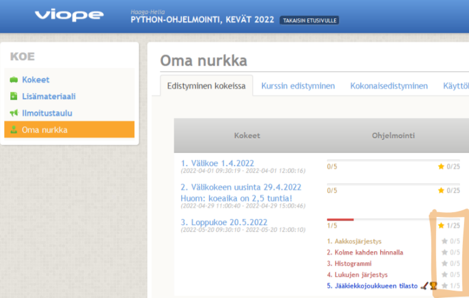
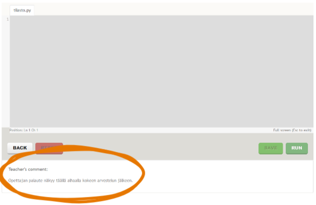

[🔙 Takaisin etusivulle](./)

# Kokeet

Tällä sivulla on oleellista tietoa kokeeseen valmistautumiseen sekä kokeen järjestelyihin ja käytäntöihin liittyen, joten luethan sen kokonaan, vaikka sivu on ~~tuskaisen~~ pitkä.

## Viope-oppimisalusta

Koe järjestetään hyödyntäen Viope-oppimisalustaa, joka arvioi tehtävät automaattisesti melko samankaltaisesti, kuin mitä olemme tähän asti viikkotehtävissä tehneet. Suurelle osalle Viope on myös tuttu aikaisemmilta tai rinnakkaisilta kursseilta. Jos sinulla on jo olemassa Viope-tunnukset, voit käyttää niitä tässä kokeessa. Mikäli sinulla ei ole tunnuksia, rekisteröidy osoitteessa [https://hh.viope.com](https://hh.viope.com) mieluiten heti, mutta viimeistään koetta edeltävänä päivänä. Valitse kirjautumisruudun vasemmasta laidasta kohta "ilmoittaudu kurssille" ja valitse kurssiksi "Python-harjoituskoe". Voit harjoitella harjoituskokeessa tehtäviin vastaamista.

Löydätte Viopesta koepäivänä sekä kokeen tehtävänannot että tekstikentät, joihin liitätte omat ratkaisunne. Viope suorittaa koodinne ja antaa siitä pisteet, mikäli tulos vastaa tehtävänantoa. Mikäli vastausta ei hyväksytä, voitte kokeilla uudelleen rajoittamattoman määrän kertoja. Kun Viope hyväksyy ratkaisunne, muistakaa painaa "lähetä/submit" -painiketta, jotta tehtävä tallentuu. Toiminta selkenee varmasti viimeistään kokeilemalla harjoituskoetta, josta lisätietoja alempana tässä ohjeessa.

Viopen kanssa on ehdottoman suositeltavaa, että koodaatte ja kokeilette oman ratkaisunne ensin VS Codessa ja liitätte sen tehtäväsivulle vasta koodin toimiessa omalla koneellanne.

 
## Kokeen tehtävät ja niiden arviointi

Kokeessa on viisi tehtävää, joista kukin on viiden pisteen arvoinen. Tehtävät vastaavat tyyliltään kurssin viikkotehtäviä, mutta aikaisemmista tehtävistä poiketen kokeen tehtävät tullaan arvioimaan myös manuaalisesti. Voitte siis saada tehtävästä pisteitä, vaikka Viope ei hyväksyisi ratkaisua.

Huomioimme keskeneräisten tehtävien arvioinnissa sellaiset osat, jotka osoittavat selvää osaamista tehtävän aiheen tiimoilta, eli pyrkikää vastaamaan kaikkiin tehtäviin parhaanne mukaan, vaikka ette niitä saisikaan tehtyä kokonaan oikein. Muistakaa myös lähettää tehtävät arvioitavaksi tai tallentaa ne keskeneräisinä, jotta pystymme arvioimaan ne.

### Luova ongelmanratkaisu

Moniin tehtäviin löytyy lukuisia erilaisia ratkaisutapoja. Ennen tehtävän ratkaisua pohdi, voidaanko se ratkaista esimerkiksi listoilla, sanakirjoilla tai kenties jopa ilman kokoelmaa. Jos ratkaisusi kasvaa useiksi kymmeniksi riveiksi koodia, löytyisi tehtävään todennäköisesti myös helpompi ratkaisutapa.

### Pyöristykset, virheelliset syötteet yms.

Tehtävien automaattisessa arvioinnissa on tärkeää, että ohjelmasi tulostaa esimerkiksi numerot kuten ne on tehtävän esimerkkisuorituksessa esitetty. Oletuksena ratkaisussa ei tarvitse pyöristää tai muuten muotoilla numeroita, ellei tehtävänannossa erikseen sitä pyydetä. Liukuluvut tulostetaan siis "oletusesityksellä", eli niiden desimaaliosan pituus voi vaihdella. Oletuksena tehtävissä ei myöskään pidä taivuttaa tekstejä eri tavoilla yksikköön tai monikkoon ("1 tuote" ja "2 tuotetta"), ellei sitä erikseen tehtävässä pyydetä.

Tehtävissä ei tarvitse varautua virheellisiin syötteisiin tai muihin poikkeustilanteisiin, ellei sitä erikseen pyydetä.

## Harjoituskoe

Olemme tehneet Viopen käytön ja kokeeseen valmistautumisen tueksi erillisen harjoituskokeen, jonka voitte halutessanne tehdä itsenäisesti oman aikataulunne mukaan. Harjoituskoe löytyy Viopen etusivun alaosasta ([https://hh.viope.com](https://hh.viope.com)) nimellä "Python-harjoituskoe". Harjoituskokeessa tehtäviä, jotka on lainattu kurssin viikkotehtävistä. Kokeen tehtävät tulevat olemaan tyyliltään ja luonteeltaan näiden tehtävien mukaisia, mutta erityisesti loppukokeessa astetta haastavampia.

 
## Kokeeseen osallistuminen

Liittykää Viopen etusivulla kurssille nimeltä "Python-ohjelmointi, kevät 2022". Voitte liittyä kurssille jo etukäteen, mutta koetehtävät aukeavat ajastetusti kokeen alkuhetkellä. Päivitä tarvittaessa Viopen näkymä selaimessasi kokeen alkaessa, jotta pääset siirtymään tehtäviin.

Seuratkaa kokeen aikana kelloa tai laittakaa itsellenne muistutus, jotta varmasti ehditte lähettää ja tallentaa kaikki tehtävät ennen kokeen päättymistä.

## Kokeen pelisäännöt

Kokeessa saa käyttää kurssin tavanomaisia tietolähteitä, kuten Google, Stack Overflow ja mooc.fi. Saat lisäksi tutkia kurssin esimerkkikoodeja ja omia kurssilla kirjoittamiasi koodeja, mutta koodin suora kopiointi kokeen vastauksiin on kiellettyä. Kaikki viestintä ja kokeesta keskusteleminen on myös kiellettyä.

Ohjelmasi ei saa vilpillisesti harhauttaa tehtävän tarkastimia siten, että se tuottaa oikean vastauksen tehtävässä käytettäville testisyötteille toteuttamatta tehtävänannossa kuvailtua logiikkaa. Tällaiset ratkaisut hylätään, ja tahalliseksi katsottava vilppi voi johtaa myös koko kokeen hylkäykseen.

# Kokeen tulokset ja palautteet

Kokeen jälkeen näet saamasi pisteet ja palautteet Viopesta kohdasta "Oma nurkka" (my corner). Huom! Tämä on ainoa paikka, jossa näkyy manuaalisessa arvioinnissa annetut varsinaiset pisteet:

Jokaisen tehtävän kohdalla, jossa manuaalinen arviointi poikkeaa Viopen automaattisesta arvioinnista, löydät opettajan kommentin tehtäväsivun alaosasta:

