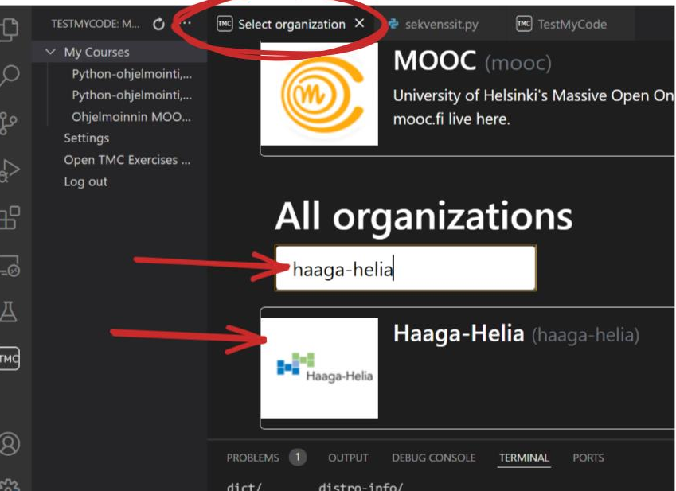

[🔙 Takaisin etusivulle](./)

# Mooc.fi-rekisteröityminen

Kurssin harjoitusten suorittamiseksi sinun tulee rekisteröityä Helsingin yliopiston MOOC-kurssille osoitteessa [https://ohjelmointi-23.mooc.fi/](https://ohjelmointi-23.mooc.fi/). Sen lisäksi sinun tulee valita profiilisi asetuksista Haaga-Helian kurssi, jotta saat ratkaisemistasi tehtävistä pisteet.

Kirjauduttuasi sisään mooc.fi:n, siirry profiiliisi klikkaamalla oikean yläkulman käyttäjäkuvaketta tai suoraan linkistä [https://ohjelmointi-23.mooc.fi/profile](https://ohjelmointi-23.mooc.fi/profile).

Rastita sen jälkeen ruutu "Suoritan muuta kurssia kuin mooc.fi:n kaikille avointa verkkokurssia tai Helsingin yliopiston kurssia" ja valitse pudotusvalikosta "Haaga-Helia: Python-ohjelmointi...".

Muista myös tallentaa profiilisi muutokset sivun alaosan "Tallenna" painikkeella.

## TMC-laajennos

Osasta 4 alkaen tehtävät palautetaan VS Code:n TMC-laajennuksen avulla, eikä tehtäviä voi palauttaa enää verkkoselaimen kautta.

Lue Mooc.fi:n ohjeesta kohdat ["TestMyCode -laajennuksen asentaminen VS Codeen"](https://www.mooc.fi/fi/installation/vscode/#TestMyCode-asentaminen) sekä ["ohjelmoinnin aloittaminen"](https://www.mooc.fi/fi/installation/vscode/#ohjelmoinnin-aloittaminen). Varmista lisäksi, että liityt myös VS Codessa oikealle kurssille [tämän kuvan mukaisesti](./img/kurssin-valinta-tmc.png):

